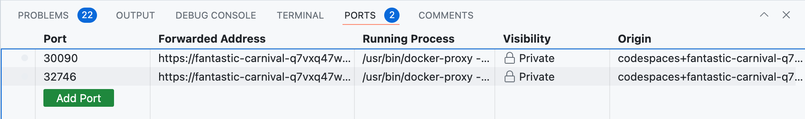

# Argo Workflows Codespaces Template

A GitHub Codespaces repository for Argo Workflows Training.

## Overview

This codespace will create a kubernetes cluster with Argo Workflows installed. It contains examples using various workflow features, including S3 artifact storage and archiving workflows into an SQL persistent store. 

## Instructions

These examples can be followed using GitHub Codespaces, or with a local cluster (e.g. minikube, k3s, kind, docker desktop). Follow the corresponding setup instructions 

### GitHub Codespaces 

1. Fork this repository
2. Click `< > Code` Codespaces
3. Select "Create codespcae on main"
4. Wait for the Codespace to come up and `kubectl get pods` starts working from the Terminal

### Local Cluster

If running a local cluster, apply the argo-workflows installation manifests:

```
kubectl apply -k ./install/argo-workflows
```

## Accessing the Argo and MinIO UI

### GitHub Codespaces 

1. Visit Ports tab


2. Hover over one of the ports "Forwarded Address" and click on globe icon to open the page in a new tab.

Ports are mapped to:
* Argo UI: 32746
* MinIO Console: 30090

### Local Cluster

Visit the localhost node port:

* Argo UI: http://localhost:32746
* MinIO Console: http://localhost:30090

## Workflow RBAC

Unless specified, Workflows will run pods with the `default` ServiceAccount. The following gives the pods the necessary privileges for communicating workflow results and running the examples in this tutorial.

```
kubectl apply -k install/rbac
argo submit --watch examples/hello-world.yaml
```

## Artifact Repositories

Workflows can be configured with an artifact repository to pass files from step to step.

Install minio s3 object store with the `mybucket` Bucket, and configure the bucket to be used as the default artifact repository for workflows in the namespace:

```
kubectl apply -k ./install/minio
kubectl apply -f examples/artifacts/artifact-repositories.yaml
```

Submit a workflow that passes artifacts between steps:
```
argo submit --watch examples/artifacts/artifact-passing.yaml
```

Artifacts can be seen in the Minio console

## Synchronnization

Apply the semaphore used in the next examples:
```
kubectl apply -f ./examples/synchronization/my-semaphores.yaml
```

### Workflow Semaphore

Submit the wf-semaphore three times.
```
argo submit examples/synchronization/wf-semaphore.yaml
argo submit examples/synchronization/wf-semaphore.yaml
argo submit examples/synchronization/wf-semaphore.yaml
```

Third submission should stay pending until first completes:

```
$ argo list
NAME                 STATUS                AGE   DURATION   PRIORITY   MESSAGE
wf-semaphore-f4j9l   Pending               2s    0s         0          Waiting for default/ConfigMap/my-semaphores/workflow lock. Lock status: 0/2
wf-semaphore-xlr7x   Running               2s    2s         0
wf-semaphore-9fdd9   Running               2s    2s         0
```

### Workflow Mutex


Submit the wf-semaphore twice.
```
argo submit examples/synchronization/wf-mutex.yaml
argo submit examples/synchronization/wf-mutex.yaml
```

Second submission should stay pending until first completes:
```
wf-mutex-4l5bm       Pending               3s    0s         0          Waiting for default/Mutex/wf-mutex lock. Lock status: 0/1
wf-mutex-zlz98       Running               3s    3s         0
```

### Template Semaphore

Submi multi-step workflow using template semaphore:

```
argo submit --watch examples/synchronization/template-semaphore.yaml
```

Since semaphore is of size 3, only three will be allowed to run:
```
Name:                template-semaphore-cwvrk
Namespace:           default
ServiceAccount:      unset (will run with the default ServiceAccount)
Status:              Running
Conditions:
 PodRunning          True
Created:             Tue May 14 05:40:00 -0700 (19 seconds ago)
Started:             Tue May 14 05:40:00 -0700 (19 seconds ago)
Duration:            19 seconds
Progress:            0/5

STEP                         TEMPLATE            PODNAME                                           DURATION  MESSAGE
 ● template-semaphore-cwvrk  template-semaphore
 └─┬─● acquire-lock(0:1)     acquire-lock        template-semaphore-cwvrk-acquire-lock-2743919518  19s
   ├─● acquire-lock(1:2)     acquire-lock        template-semaphore-cwvrk-acquire-lock-2016457668  19s
   ├─● acquire-lock(2:3)     acquire-lock        template-semaphore-cwvrk-acquire-lock-405191702   19s
   ├─◷ acquire-lock(3:4)     acquire-lock        template-semaphore-cwvrk-acquire-lock-3509870496  19s       Waiting for default/ConfigMap/my-semaphores/template lock. Lock status: 0/3
   └─◷ acquire-lock(4:5)     acquire-lock        template-semaphore-cwvrk-acquire-lock-1475844870  19s       Waiting for default/ConfigMap/my-semaphores/template lock. Lock status: 0/3
```

### Template Mutex

Submit two workflow using template mutex:

```
argo submit examples/synchronization/template-mutex.yaml
argo submit examples/synchronization/template-mutex.yaml
```

Second submission will be blocked waiting for the mutex:

```
$ argo get template-mutex-7q2s2
Name:                template-mutex-7q2s2
Namespace:           default
ServiceAccount:      unset (will run with the default ServiceAccount)
Status:              Running
Conditions:
 PodRunning          False
Created:             Tue May 14 05:45:50 -0700 (11 seconds ago)
Started:             Tue May 14 05:45:50 -0700 (11 seconds ago)
Duration:            11 seconds
Progress:            1/2
ResourcesDuration:   0s*(1 cpu),5s*(100Mi memory)

STEP                     TEMPLATE  PODNAME                                   DURATION  MESSAGE
 ● template-mutex-7q2s2  main
 └─┬─◷ sleep             sleep     template-mutex-7q2s2-sleep-1194113618     11s       Waiting for default/Mutex/template-mutex lock. Lock status: 0/1
   └─✔ whalesay          whalesay  template-mutex-7q2s2-whalesay-2294686955  5s
```

## Memoization

Submit a workflow that memoizes one of its step. Repeat this and notice second run is immediate and has same value.
```
argo submit examples/memoization/memoization.yaml

argo submit examples/memoization/memoization.yaml
```

Observe/clear the memoization cache
```
kubectl get -n argo cm memo-cache
kubectl delete -n argo cm memo-cache
```

Submit it a third time and notice output is different
```
argo submit examples/memoization/memoization.yaml
```


## HTTP Template

Submit the HTTP Template example:

```
argo submit --watch examples/http-template.yaml
```

## Plugin Template

Install the hello-executor plugin:
```
kubectl apply -n argo -f install/hello-executor-plugin/hello-executor-plugin-configmap.yaml
```
NOTE: the required step of enabling plugins has already been completed as part of the [install](install/argo-workflows/executor-plugins.yaml)

Submit the Plugin example:

```
argo submit examples/plugin-template.yaml
```

Uninstall:
```
kubectl delete -n argo -f install/hello-executor-plugin/hello-executor-plugin-configmap.yaml
```

## Graceful Workflow Stoppage

Start a long running workflow (sleeps for 5m):
```
argo submit examples/sleep.yaml
```

Stop the workflow before it would otherwise naturally end
```
argo stop sleep-xxxxx
```

## Workflow Archive

Workflows can be persisted to a SQL database for long term storage.

Install postgres and reconfigure workflows to use a database:

```
kubectl apply -k install/workflow-archive/
kubectl rollout restart deploy -n argo argo-server workflow-controller
```

Submit a workflow with a label indicating it should be archived.

```
argo submit --watch examples/archived-wf.yaml
```

The workflow will be deleted 5 seconds after completion (using `ttlStrategy`), but will still visible from the workflow UI.


## Local Argo Server

Argo Server is typically run as internally reachable service for users to access and view workflows. Authentication can be via SSO or ServiceAccount tokens. However, in more secure/restrictive environments the workflows API server may not allowed to be exposed. In this scenario users can still run a local Argo API server on their workstation, so long as they have kubectl access to their namespace:

```
argo server --auth-mode=server --secure=false -n argo
```

The Workflow UI can then be browsed locally http://localhost:2746/.
